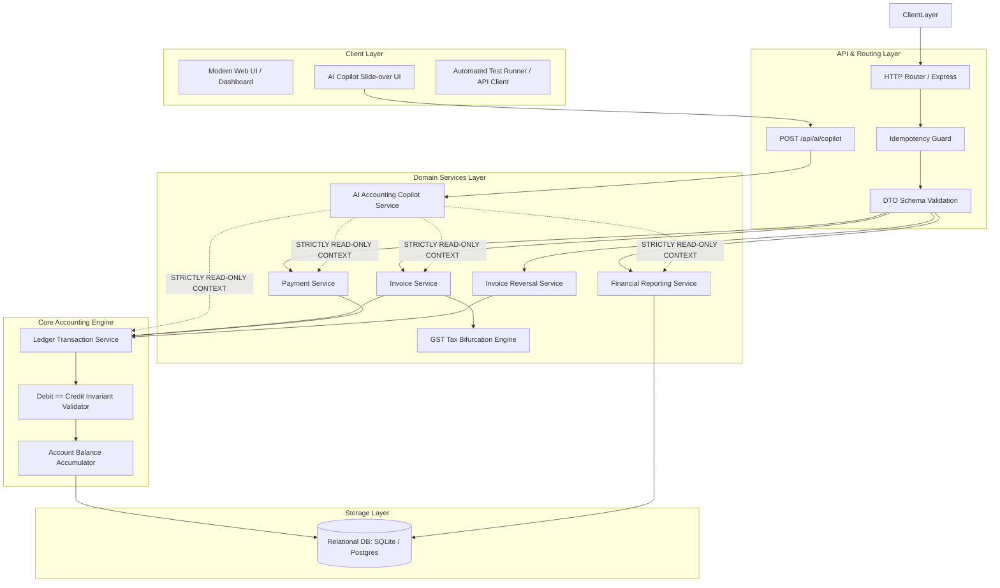
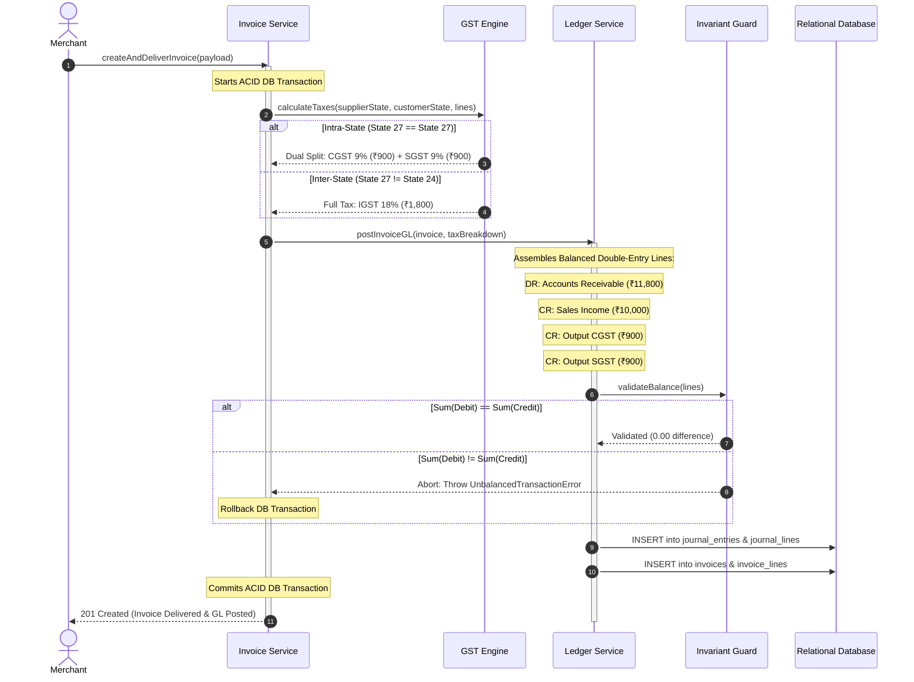
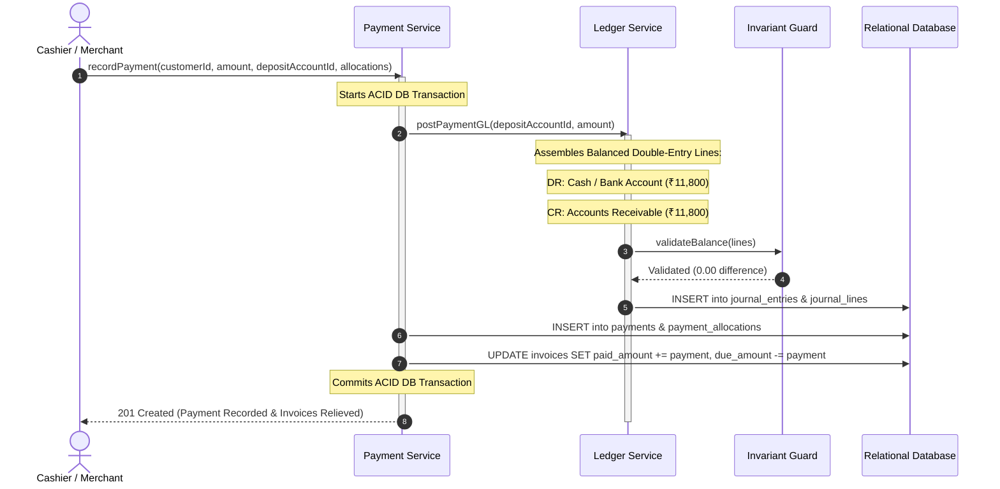
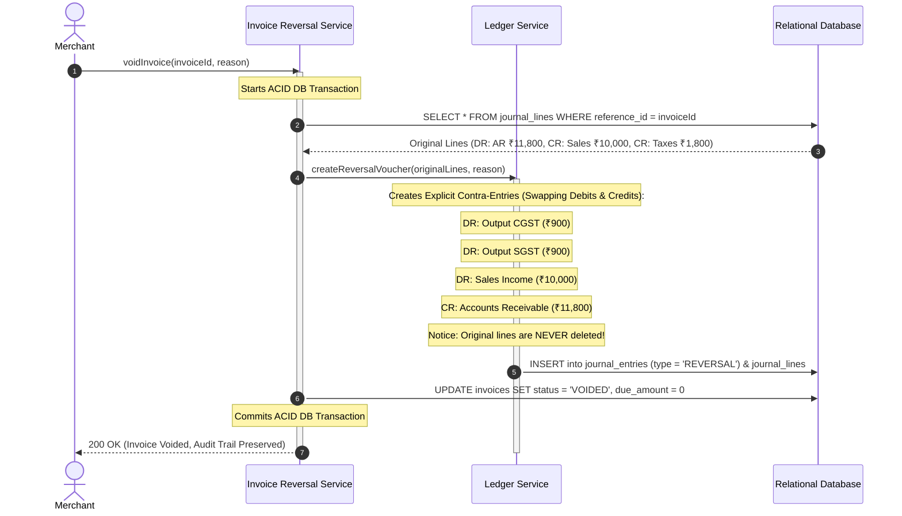
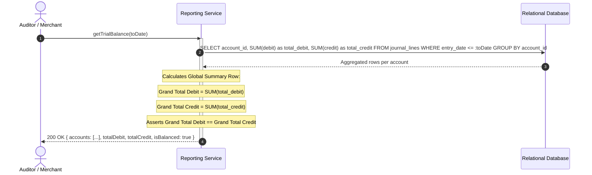

# ARCHITECTURE.md — System Architecture: GST-Ready Accounting Ledger

This document specifies the technical architecture for the clean-room rebuild of the GST-Ready Accounting Ledger (V1).

---

## 1. Architecture Overview

The system is designed as a **deterministic, modular accounting engine** built on Node.js/TypeScript and SQLite/PostgreSQL. It prioritizes double-entry accounting integrity, ACID transactional boundaries, immutable audit logging, and automated Indian GST compliance.

Unlike Bigcapital's multi-queue asynchronous ledger commit model, our rebuild uses an **Atomic Unit-of-Work Pattern** where invoice/payment document creation, double-entry journal posting, balance recalculation, and tax allocation occur inside a single ACID database transaction.



---

## 2. Components & Responsibilities

| Component | Responsibility | Inputs | Outputs |
|---|---|---|---|
| **Idempotency Guard** | Ensures network retries do not process duplicate financial transactions. | `Idempotency-Key` header | Cached response or pass-through |
| **Invoice Service** | Manages B2B invoice lifecycle (Draft, Deliver, Void); computes item totals. | Customer ID, line items, date | Saved invoice document, trigger GL |
| **GST Bifurcation Engine** | Evaluates supplier vs customer state codes and splits tax into CGST/SGST or IGST. | Supplier state, Customer state, rate | Tax breakdown: `{ cgst, sgst, igst }` |
| **Payment Service** | Captures customer payments, allocates to open invoices, relieves accounts receivable. | Customer ID, amount, deposit account | Saved payment, invoice reconciliation |
| **Invoice Reversal Service** | Executes immutable cancellations by writing contra-journal entries. | Invoice ID, reason | Reversing journal voucher, void status |
| **Ledger Transaction Service** | Core double-entry dispatcher; coordinates multi-line journal postings. | Journal entry lines `[{ accountId, debit, credit }]` | Persisted transactions |
| **Debit/Credit Invariant Validator** | Zero-trust gatekeeper verifying $\sum \text{Debit} == \sum \text{Credit}$ before DB write. | Journal entry lines | `true` or throws `UnbalancedTransactionError` |
| **Financial Reporting Service** | Aggregates general ledger entries into Trial Balance and GSTR-1 returns. | As-of date, date range | Trial Balance table, GST summary |
| **AI Accounting Copilot Service** | Translates natural language questions into read-only ledger queries and explanations. | User prompt, read-only accounting context | Grounded explanation with cited sources |

---

## 3. Communication Protocols

- **External Interface**: Synchronous HTTP/JSON REST API.
- **Wire Format**: Strict `camelCase` for JSON payloads.
- **Internal Execution**: In-process synchronous TypeScript service invocations within a single execution thread to guarantee deterministic ordering.
- **Transactional Boundary**: All operations modifying documents and general ledger lines run within an explicit `BEGIN TRANSACTION` ... `COMMIT` block.

---

## 4. State Locations

| State Entity | Location | Persistence Mechanism | Concurrency Control |
|---|---|---|---|
| **Invoices & Items** | Database Table: `invoices`, `invoice_lines` | Relational rows | Transactional lock |
| **Payments & Allocations** | Database Table: `payments`, `payment_allocations` | Relational rows | Transactional lock |
| **General Ledger** | Database Table: `journal_entries`, `journal_lines` | Relational rows (Immutable) | Append-only |
| **Account Balances** | Computed dynamically from `journal_lines` (Optionally cached in `accounts.balance`) | SQL Aggregation / `decimal(15, 4)` | Atomic SQL delta update |
| **Idempotency Records** | Database Table: `idempotency_keys` | Relational rows with TTL | Unique key constraint |

---

## 5. Core Accounting Engine Workflows

### A. Invoice Posting & GST Bifurcation Flow



---

### B. Payment Settlement Flow



---

### C. Immutable Reversal Flow (Killer Test 2)



---

### D. Trial Balance Reporting Pipeline (Killer Tests 1 & 3)



---

## 6. GST Tax Rules & Behavior

1. **State Code Basis**:
   - The organization has a home State Code (e.g. `27` - Maharashtra).
   - Customers have a State Code derived from their GSTIN or address.
2. **Place of Supply Rule**:
   - `Customer.stateCode === Organization.stateCode` $\to$ **Intra-State**: Tax rate (e.g. 18%) is split exactly 50/50 into **CGST (9%)** and **SGST (9%)**.
   - `Customer.stateCode !== Organization.stateCode` $\to$ **Inter-State**: Full tax rate (18%) is allocated to **IGST**.
3. **Statutory Accounts**:
   - `Output CGST Payable` (Current Liability)
   - `Output SGST Payable` (Current Liability)
   - `Output IGST Payable` (Current Liability)
4. **HSN Categorization**:
   - Each invoice line mandates an HSN code (e.g., `8471` for computers, `9983` for IT services), aggregated in the GSTR-1 summary.

---

## 7. Integrity Rules & Killer Test Enforcement

| Killer Test | Architectural Mechanism | Implementation Guarantee |
|---|---|---|
| **Killer Test 1 (Transaction Balancing)** | `Debit/Credit Invariant Validator` executes inside the synchronous transaction loop. | Throws `UnbalancedTransactionError` before SQL insert if $\lvert \sum \text{Debit} - \sum \text{Credit} \rvert \ge 0.0001$. Zero unbalanced rows can enter the database. |
| **Killer Test 2 (Invoice Voiding Reversal)** | Reversal Engine writes append-only contra-entries; SQL `DELETE` is prohibited on `journal_lines`. | The original rows remain intact with their primary keys; new reversal rows balance the net account deltas to zero while maintaining an immutable audit log. |
| **Killer Test 3 (Trial Balance Equilibrium)** | Relational grouping query `SELECT SUM(debit), SUM(credit) ... GROUP BY account_id`. | Mathematical induction: If starting balance is 0 and every operation adds $\Delta \text{Debit} \equiv \Delta \text{Credit}$, the global sum across 20 random operations remains strictly balanced. |

---

## 8. AI Accounting Copilot Architecture & Read-Only Invariant

### 1. Data Flow

```text
Frontend
   ↓
AI Copilot UI
   ↓
POST /api/ai/copilot
   ↓
AI Service
   ↓
Read-only Accounting Data / Reporting Services
   ↓
Invoices / Payments / Journal / GST / Trial Balance
```

### 2. Critical Rule: Strict Read-Only Boundary
> **The AI must NEVER directly modify accounting data.**

The AI Copilot operates purely as an advisory and explanatory agent. Under NO circumstances may the AI:
- Create journal entries or vouchers.
- Modify or create sales invoices.
- Record or modify payments.
- Change GST rates, tax split calculations, or ledger amounts.
- Delete accounting records.
- Bypass user authorization or authentication guards.
- Bypass double-entry accounting invariants.

The **deterministic double-entry accounting engine remains the single source of truth**.

### 3. Environment Variables
The application supports an optional AI integration controlled entirely via environment variables:

```env
# AI Copilot Configuration (Optional)
AI_ENABLED=false
AI_PROVIDER=gemini
AI_API_KEY=
AI_MODEL=gemini-1.5-flash
```

**Security Mandate**:
- The application **must work completely without an AI API key**.
- The API key must **never** be hardcoded, saved to Git, or exposed to the frontend client.

### 4. AI Testing Specification
The test suite includes 4 specific AI verification tests:

- **AI Test 1 — AI Configured & Grounded Answer**:
  `Question → AI Service → Real Accounting Service Query → Grounded Answer with Source Documents`
- **AI Test 2 — AI Disabled / No Key**:
  `AI_ENABLED=false → Application boots and functions 100% normally → Invoices, payments, GL, reports completely unaffected`
- **AI Test 3 — Read-Only Invariant Enforcement**:
  `Prompt requesting mutation (e.g. "Create a ₹5,000 payment") → Service detects mutation intent → Rejects command → Zero DB writes`
- **AI Test 4 — Provider Failure Resilience**:
  `AI provider endpoint unavailable/timeout → Controlled fallback response ("Copilot temporarily unavailable") → Accounting system remains operational`

---

## 9. Implementation & Testing Order (Killer Tests First!)

The engineering team must adhere strictly to the following implementation order:

```text
1. Core accounting engine & Chart of Accounts seed
2. Killer Test 1: Every transaction balances (Invariant Guard)
3. Killer Test 2: Voiding an invoice reverses its journal entries (Immutable Reversals)
4. Killer Test 3: Trial balance balances after 20 random operations
5. Fix 1 from GAPS.md (Transaction Balancing Guard & Immutable Reversal Engine)
6. Differentiator 2: AI Accounting Copilot (Read-Only Interface & Service)
7. AI Tests 1–4
8. Run Killer Tests 1–3 AGAIN to certify regression safety
9. Full end-to-end regression testing
10. Final submission
```

