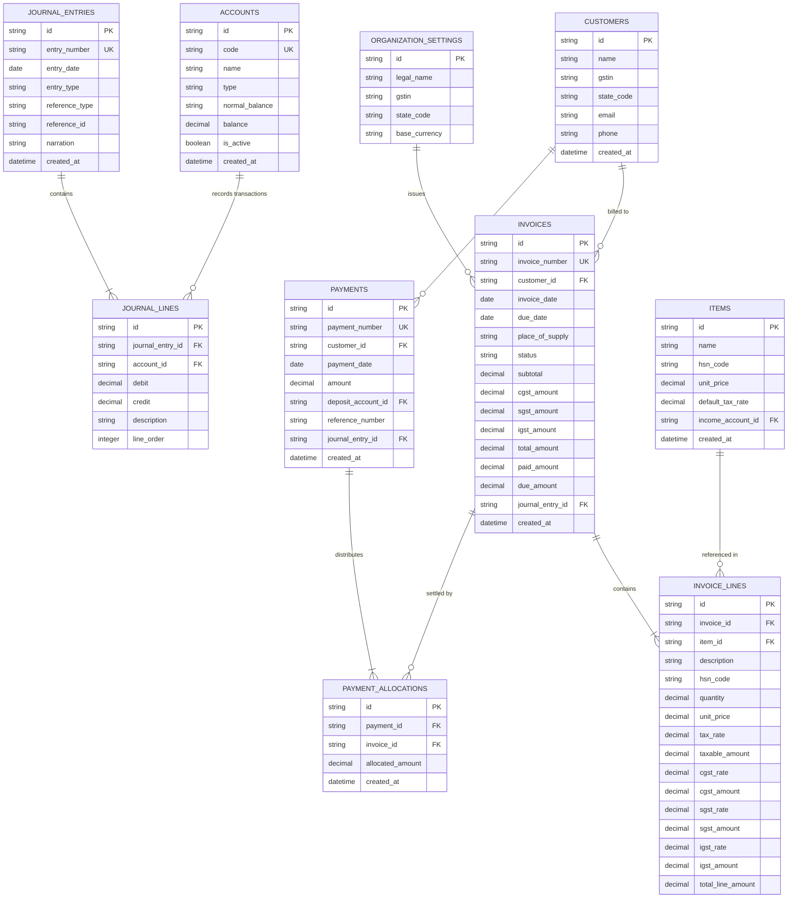

# DATA_MODEL.md — Data Model Specification: GST-Ready Accounting Ledger

This document defines the relational database schema, integrity constraints, and entity relationships for the clean-room rebuild of the GST-Ready Accounting Ledger.

---

## 1. Entity Relationship Diagram

---

## 2. Entity Definitions

### 1. `ORGANIZATION_SETTINGS`
- **Purpose**: Defines the merchant entity, home GSTIN, and base state code for Place of Supply evaluation.
- **Fields**:
  - `id`: `VARCHAR(36)` | Required | Primary Key
  - `legal_name`: `VARCHAR(255)` | Required | Legal business name
  - `gstin`: `VARCHAR(15)` | Required | 15-character statutory GST identification number
  - `state_code`: `VARCHAR(2)` | Required | 2-digit Indian State Code (e.g. `"27"` for Maharashtra)
  - `base_currency`: `VARCHAR(3)` | Required | Default `"INR"`
- **Accounting Meaning**: Determines the origin of supply; if customer state equals `state_code`, supply is intra-state (CGST+SGST).

---

### 2. `CUSTOMERS`
- **Purpose**: Master table for B2B buyers and debtors.
- **Fields**:
  - `id`: `VARCHAR(36)` | Required | Primary Key
  - `name`: `VARCHAR(255)` | Required | Business / Trade Name
  - `gstin`: `VARCHAR(15)` | Optional | Customer's GSTIN (determines B2B vs B2C status)
  - `state_code`: `VARCHAR(2)` | Required | 2-digit Indian State Code for destination tax
  - `email`: `VARCHAR(255)` | Optional
  - `phone`: `VARCHAR(50)` | Optional
  - `created_at`: `DATETIME` | Required
- **Indexes**: `CREATE INDEX idx_customers_state ON customers(state_code)`
- **Accounting Meaning**: The debtor entity linked to Accounts Receivable balances.

---

### 3. `ACCOUNTS` (Chart of Accounts)
- **Purpose**: General ledger accounts categorizing assets, liabilities, equity, revenues, and expenses.
- **Fields**:
  - `id`: `VARCHAR(36)` | Required | Primary Key
  - `code`: `VARCHAR(20)` | Required | Unique Account Code (e.g. `"1010"`, `"2010"`)
  - `name`: `VARCHAR(255)` | Required | Account Name (e.g. `"Accounts Receivable"`, `"Output CGST Payable"`)
  - `type`: `VARCHAR(50)` | Required | `ASSET`, `LIABILITY`, `EQUITY`, `INCOME`, `EXPENSE`
  - `normal_balance`: `VARCHAR(6)` | Required | `DEBIT` or `CREDIT`
  - `balance`: `DECIMAL(15, 4)` | Required | Current running balance (Default `0.0000`)
  - `is_active`: `BOOLEAN` | Required | Active status (Default `true`)
  - `created_at`: `DATETIME` | Required
- **Unique Constraints**: `code`
- **Pre-Seeded Required Accounts**:
  - `1000` — `Cash on Hand` (`ASSET`, Normal: `DEBIT`)
  - `1010` — `Bank Checking Account` (`ASSET`, Normal: `DEBIT`)
  - `1200` — `Accounts Receivable` (`ASSET`, Normal: `DEBIT`)
  - `2110` — `Output CGST Payable` (`LIABILITY`, Normal: `CREDIT`)
  - `2120` — `Output SGST Payable` (`LIABILITY`, Normal: `CREDIT`)
  - `2130` — `Output IGST Payable` (`LIABILITY`, Normal: `CREDIT`)
  - `4000` — `Sales Income` (`INCOME`, Normal: `CREDIT`)

---

### 4. `ITEMS` (Products / Services Catalog)
- **Purpose**: Sellable items with default pricing and HSN codes.
- **Fields**:
  - `id`: `VARCHAR(36)` | Required | Primary Key
  - `name`: `VARCHAR(255)` | Required | Item Name
  - `hsn_code`: `VARCHAR(8)` | Required | Harmonized System of Nomenclature code (e.g. `"8471"`)
  - `unit_price`: `DECIMAL(15, 4)` | Required | Default selling price
  - `default_tax_rate`: `DECIMAL(5, 2)` | Required | Percentage slab (e.g. `18.00` for 18%)
  - `income_account_id`: `VARCHAR(36)` | Required | Foreign Key $\to$ `ACCOUNTS(id)`
  - `created_at`: `DATETIME` | Required
- **Accounting Meaning**: Dictates the credit revenue account and statutory HSN classification on invoice lines.

---

### 5. `INVOICES`
- **Purpose**: Sales invoice documents issued to customers.
- **Fields**:
  - `id`: `VARCHAR(36)` | Required | Primary Key
  - `invoice_number`: `VARCHAR(50)` | Required | Unique document voucher number (e.g. `"INV-0001"`)
  - `customer_id`: `VARCHAR(36)` | Required | Foreign Key $\to$ `CUSTOMERS(id)`
  - `invoice_date`: `DATE` | Required | Transaction date
  - `due_date`: `DATE` | Required | Payment due date
  - `place_of_supply`: `VARCHAR(2)` | Required | Destination State Code
  - `status`: `VARCHAR(20)` | Required | `DRAFT`, `DELIVERED`, `VOIDED`
  - `subtotal`: `DECIMAL(15, 4)` | Required | Sum of taxable line items
  - `cgst_amount`: `DECIMAL(15, 4)` | Required | Central GST total
  - `sgst_amount`: `DECIMAL(15, 4)` | Required | State GST total
  - `igst_amount`: `DECIMAL(15, 4)` | Required | Integrated GST total
  - `total_amount`: `DECIMAL(15, 4)` | Required | Grand Total: `subtotal + cgst + sgst + igst`
  - `paid_amount`: `DECIMAL(15, 4)` | Required | Cumulative payments applied (Default `0.0000`)
  - `due_amount`: `DECIMAL(15, 4)` | Required | Remaining debt: `total_amount - paid_amount`
  - `journal_entry_id`: `VARCHAR(36)` | Optional | Foreign Key $\to$ `JOURNAL_ENTRIES(id)`
  - `created_at`: `DATETIME` | Required
- **Unique Constraints**: `invoice_number`
- **Accounting Meaning**: When `status` moves to `DELIVERED`, creates accounts receivable debt and revenue/tax liabilities.

---

### 6. `INVOICE_LINES`
- **Purpose**: Detail rows for individual goods or services billed on an invoice.
- **Fields**:
  - `id`: `VARCHAR(36)` | Required | Primary Key
  - `invoice_id`: `VARCHAR(36)` | Required | Foreign Key $\to$ `INVOICES(id)`
  - `item_id`: `VARCHAR(36)` | Required | Foreign Key $\to$ `ITEMS(id)`
  - `description`: `VARCHAR(255)` | Optional | Line item description
  - `hsn_code`: `VARCHAR(8)` | Required | Item HSN code at time of billing
  - `quantity`: `DECIMAL(12, 4)` | Required | Units sold
  - `unit_price`: `DECIMAL(15, 4)` | Required | Unit rate
  - `tax_rate`: `DECIMAL(5, 2)` | Required | Total GST percentage (e.g. `18.00`)
  - `taxable_amount`: `DECIMAL(15, 4)` | Required | `quantity * unit_price`
  - `cgst_rate`: `DECIMAL(5, 2)` | Required | Half of tax_rate if intra-state, else 0
  - `cgst_amount`: `DECIMAL(15, 4)` | Required | Computed CGST value
  - `sgst_rate`: `DECIMAL(5, 2)` | Required | Half of tax_rate if intra-state, else 0
  - `sgst_amount`: `DECIMAL(15, 4)` | Required | Computed SGST value
  - `igst_rate`: `DECIMAL(5, 2)` | Required | Full tax_rate if inter-state, else 0
  - `igst_amount`: `DECIMAL(15, 4)` | Required | Computed IGST value
  - `total_line_amount`: `DECIMAL(15, 4)` | Required | Taxable + all taxes

---

### 7. `PAYMENTS`
- **Purpose**: Remittance records received from customers.
- **Fields**:
  - `id`: `VARCHAR(36)` | Required | Primary Key
  - `payment_number`: `VARCHAR(50)` | Required | Unique voucher number (e.g. `"PAY-0001"`)
  - `customer_id`: `VARCHAR(36)` | Required | Foreign Key $\to$ `CUSTOMERS(id)`
  - `payment_date`: `DATE` | Required | Date remittance was received
  - `amount`: `DECIMAL(15, 4)` | Required | Total money received
  - `deposit_account_id`: `VARCHAR(36)` | Required | Foreign Key $\to$ `ACCOUNTS(id)` (Cash or Bank)
  - `reference_number`: `VARCHAR(100)` | Optional | Cheque / UTR / Transaction reference
  - `journal_entry_id`: `VARCHAR(36)` | Optional | Foreign Key $\to$ `JOURNAL_ENTRIES(id)`
  - `created_at`: `DATETIME` | Required
- **Unique Constraints**: `payment_number`

---

### 8. `PAYMENT_ALLOCATIONS`
- **Purpose**: Many-to-many junction mapping payments to the specific invoices they satisfy.
- **Fields**:
  - `id`: `VARCHAR(36)` | Required | Primary Key
  - `payment_id`: `VARCHAR(36)` | Required | Foreign Key $\to$ `PAYMENTS(id)`
  - `invoice_id`: `VARCHAR(36)` | Required | Foreign Key $\to$ `INVOICES(id)`
  - `allocated_amount`: `DECIMAL(15, 4)` | Required | Portioned payment amount applied to this invoice
  - `created_at`: `DATETIME` | Required
- **Constraints**: `allocated_amount > 0`

---

### 9. `JOURNAL_ENTRIES`
- **Purpose**: Double-entry accounting transaction header (Voucher).
- **Fields**:
  - `id`: `VARCHAR(36)` | Required | Primary Key
  - `entry_number`: `VARCHAR(50)` | Required | Unique journal voucher code (e.g. `"JV-0001"`)
  - `entry_date`: `DATE` | Required | Effective accounting date
  - `entry_type`: `VARCHAR(20)` | Required | `INVOICE`, `PAYMENT`, `REVERSAL`, `MANUAL`
  - `reference_type`: `VARCHAR(50)` | Optional | Polymorphic link: `'Invoice'`, `'Payment'`
  - `reference_id`: `VARCHAR(36)` | Optional | Document ID being posted
  - `narration`: `TEXT` | Optional | Accounting description / audit note
  - `created_at`: `DATETIME` | Required
- **Unique Constraints**: `entry_number`

---

### 10. `JOURNAL_LINES`
- **Purpose**: Individual debit and credit line items constituting the double-entry transaction.
- **Fields**:
  - `id`: `VARCHAR(36)` | Required | Primary Key
  - `journal_entry_id`: `VARCHAR(36)` | Required | Foreign Key $\to$ `JOURNAL_ENTRIES(id)` (ON DELETE RESTRICT)
  - `account_id`: `VARCHAR(36)` | Required | Foreign Key $\to$ `ACCOUNTS(id)`
  - `debit`: `DECIMAL(15, 4)` | Required | Debit amount (Default `0.0000`, CHECK `debit >= 0`)
  - `credit`: `DECIMAL(15, 4)` | Required | Credit amount (Default `0.0000`, CHECK `credit >= 0`)
  - `description`: `VARCHAR(255)` | Optional | Line memo
  - `line_order`: `INTEGER` | Required | Ordering index within voucher
- **Indexes**:
  - `CREATE INDEX idx_jl_entry ON journal_lines(journal_entry_id)`
  - `CREATE INDEX idx_jl_account ON journal_lines(account_id)`

---

## 3. Killer Test Constraints & Database Invariants

1. **Killer Test 1 (Transaction Balancing Check Constraint)**:
   - Database trigger or pre-commit service validation computes:
     `SELECT ABS(SUM(debit) - SUM(credit)) FROM journal_lines WHERE journal_entry_id = :id`
   - Must equal `0.0000`. If $> 0$, the database transaction is rolled back with an immediate error.
2. **Killer Test 2 (Immutable Audit Trail Constraint)**:
   - Foreign key constraint on `JOURNAL_LINES` has `ON DELETE RESTRICT`. Direct deletion of historical journal entries is prohibited.
   - Reversals must insert new rows with `entry_type = 'REVERSAL'`.
3. **Killer Test 3 (Decimal Precision Standardization)**:
   - All financial numeric fields use `DECIMAL(15, 4)` consistently across all tables, eliminating binary floating-point drift.
